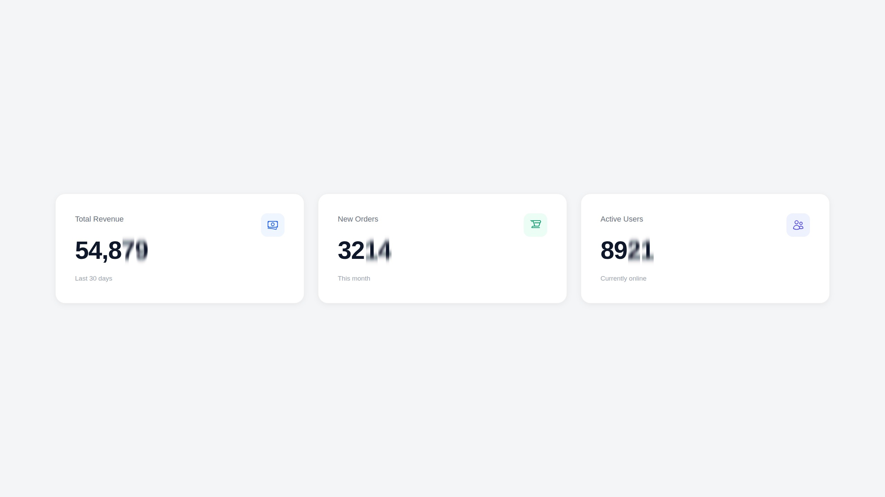

<a href="https://github.com/xplodman/filament-count-up" class="filament-hidden">

</a>

# Animated count-up numbers for Filament stat widgets and table columns

[](https://packagist.org/packages/xplodman/filament-count-up)
[](https://github.com/xplodman/filament-count-up/actions?query=workflow%3Atests+branch%3Amaster)
[](https://github.com/xplodman/filament-count-up/actions?query=workflow%3Afix-code-style+branch%3Amaster)
[](https://packagist.org/packages/xplodman/filament-count-up)

Animate any number in your Filament app — dashboard stats, custom widget cards, table columns — so it counts up from zero instead of just appearing. No `countup.js` dependency, no build step in your app: it's a small self-contained Alpine.js component shipped and registered by this package.

- Works in genuine `Stat::make()` widgets, fully custom Blade widgets, and `Tables\Columns\CountUpColumn`.
- Preserves whatever thousands/decimal separators your app already uses (plain `,`/`.` by default — not locale-aware `Intl.NumberFormat`, so it never flips to Arabic-Indic digits on an `ar` locale).
- Renders the final, correctly formatted number as static text first, so it's correct even with JavaScript disabled or before Alpine hydrates — the animation is a progressive enhancement, not a requirement for correctness.
- Respects `prefers-reduced-motion: reduce` by skipping straight to the final value.

## Installation

You can install the package via composer:

```bash
composer require xplodman/filament-count-up
```

You can publish the config file with:

```bash
php artisan vendor:publish --tag="filament-count-up-config"
```

This is the contents of the published config file:

```php
return [
    // Used whenever a component/column does not explicitly set its own value.
    'decimals' => 0,
    'duration' => 1000,
    'thousands_separator' => ',',
    'decimal_separator' => '.',
];
```

## Usage

### In a Blade view or custom widget

```blade
<x-count-up :value="1234.5" :decimals="2" prefix="EGP " />
```

This is what powers a fully custom stats card, e.g. a widget view iterating over an array of cards:

```blade
<p class="mt-2 text-3xl font-semibold">
    <x-count-up :value="$card['value']" :decimals="0" />
</p>
```

### In a genuine `Stat::make()` widget

`CountUpStat::make()` returns a `Htmlable` view, so it can be passed straight in as the stat's value:

```php
use Filament\Widgets\StatsOverviewWidget\Stat;
use Xplodman\CountUp\Facades\CountUpStat;

Stat::make('Total sales', CountUpStat::make($totalSales, decimals: 2, prefix: 'EGP '));
```

### In a table column

```php
use Xplodman\CountUp\Tables\Columns\CountUpColumn;

CountUpColumn::make('current_balance')
    ->countUpDecimals(2)
    ->countUpPrefix('EGP ')
    ->countUpDuration(750);
```

`CountUpColumn` extends the regular `TextColumn`, so `getStateUsing()`, sorting, searching, and everything else you'd expect from a text column keeps working — the raw state is simply rendered through the animated component instead of a plain string.

Available fluent methods on `CountUpColumn` (all accept a `Closure`, evaluated against the column/record):

| Method                        | Default              |
|-------------------------------|----------------------|
| `countUpDecimals(int)`        | `count-up.decimals`  |
| `countUpDuration(int)`        | `count-up.duration`  |
| `countUpThousandsSeparator()` | `count-up.thousands_separator` |
| `countUpDecimalSeparator()`   | `count-up.decimal_separator` |
| `countUpPrefix(string)`       | `''`                 |
| `countUpSuffix(string)`       | `''`                 |

## Testing

```bash
composer test
```

## Changelog

Please see [CHANGELOG](CHANGELOG.md) for more information on what has changed recently.

## Contributing

Please see [CONTRIBUTING](.github/CONTRIBUTING.md) for details.

## Security Vulnerabilities

Please review [our security policy](.github/SECURITY.md) on how to report security vulnerabilities.

## Credits

- [xplodman](https://github.com/xplodman)
- [All Contributors](../../contributors)

## License

The MIT License (MIT). Please see [License File](LICENSE.md) for more information.
