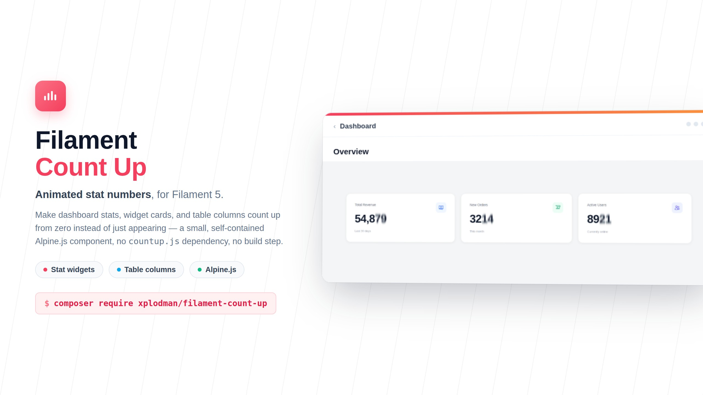

<a href="https://github.com/xplodman/filament-count-up" class="filament-hidden">

</a>

# Animated count-up numbers for Filament stat widgets and table columns

[](https://packagist.org/packages/xplodman/filament-count-up)
[](https://github.com/xplodman/filament-count-up/actions?query=workflow%3Atests+branch%3Amaster)
[](https://github.com/xplodman/filament-count-up/actions?query=workflow%3Afix-code-style+branch%3Amaster)
[](https://packagist.org/packages/xplodman/filament-count-up)
[](https://plumbphp.dev/xplodman/filament-count-up)
[](https://plumbphp.dev/xplodman/filament-count-up)
[](https://plumbphp.dev/xplodman/filament-count-up)
[](https://plumbphp.dev/xplodman/filament-count-up)

Animate any number in your Filament app — dashboard stats, custom widget cards, table columns — so it counts up from zero instead of just appearing. No `countup.js` dependency, no build step in your app: it's a small self-contained Alpine.js component shipped and registered by this package.

- Register `CountUpPlugin` on a panel and every existing `Stat::make()` widget animates automatically — no per-widget changes. See [Registering the plugin](#registering-the-plugin).
- Works in genuine `Stat::make()` widgets (with or without the plugin), fully custom Blade widgets, and `Tables\Columns\CountUpColumn`.
- Preserves whatever thousands/decimal separators your app already uses (plain `,`/`.` by default — not locale-aware `Intl.NumberFormat`, so it never flips to Arabic-Indic digits on an `ar` locale).
- Renders the final, correctly formatted number as static text first, so it's correct even with JavaScript disabled or before Alpine hydrates — the animation is a progressive enhancement, not a requirement for correctness.
- Respects `prefers-reduced-motion: reduce` by skipping straight to the final value.

## Installation

You can install the package via composer:

```bash
composer require xplodman/filament-count-up
```

You can publish the config file with:

```bash
php artisan vendor:publish --tag="filament-count-up-config"
```

This is the contents of the published config file:

```php
return [
    // Used whenever a component/column does not explicitly set its own value.
    'decimals' => 0,
    'duration' => 1000,
    'thousands_separator' => ',',
    'decimal_separator' => '.',
];
```

## Registering the plugin

Register `CountUpPlugin` on a panel to have **every** `Filament\Widgets\StatsOverviewWidget\Stat::make()` value on that panel animate automatically — no `CountUpStat::make()` call needed in any widget:

```php
use Xplodman\CountUp\CountUpPlugin;

public function panel(Panel $panel): Panel
{
    return $panel
        // ...
        ->plugins([
            CountUpPlugin::make(),
        ]);
}
```

That's it. Every existing `Stat::make($label, $value)` call on that panel — including the ones you already have, unchanged — starts counting up.

### How the automatic detection works

The plugin overrides the `filament-widgets::stats-overview-widget.stat` view so the stat's value is routed through `CountUpStat::animate()` instead of being printed as-is:

- **`Htmlable` values** (e.g. a value you already built yourself with `CountUpStat::make()`) and **`null`** pass through untouched — the plugin never double-wraps.
- **Plain `int`/`float` values** are animated whole.
- **Strings are scanned for numeric tokens** and *only those tokens* are animated — everything else (currency codes, `%`, `/`, `ms`, spaces, ...) is kept as plain text around them. This means widget code you already have keeps working exactly as it renders today, it just starts animating:

  | Existing `Stat::make()` value             | Rendered as |
  |--------------------------------------------|-------------|
  | `number_format(1250000)` → `'1,250,000'`   | `1,250,000` counts up, no other change |
  | `"{$successPct}% / {$failedPct}%"`         | both percentages count up independently, `%` and `/` stay static text |
  | `$avgLatencyMs . 'ms'`                      | the number counts up, `ms` suffix stays static |
  | `__('messages.common.placeholder_dash')` (a `—`) | no numeric token found → rendered as plain escaped text, unchanged |

- Decimal precision is inferred per token from the string itself (`"4,320.00"` → 2 decimals, `"23"` → 0 decimals), so existing `number_format()` precision is preserved automatically.

### Configuring the plugin

Chain fluent methods on `CountUpPlugin::make()`, the same way you would configure any other Filament plugin:

```php
use Xplodman\CountUp\CountUpPlugin;

CountUpPlugin::make()
    ->duration(1200)              // ms, defaults to count-up.duration
    ->decimals(2)                 // forces this many decimals on every auto-animated stat
    ->thousandsSeparator(',')     // defaults to count-up.thousands_separator
    ->decimalSeparator('.');      // defaults to count-up.decimal_separator
```

| Method                             | Effect                                                                                              | Default when omitted                    |
|-------------------------------------|-------------------------------------------------------------------------------------------------------|------------------------------------------|
| `autoAnimateStats(bool $condition = true)` | Turns the automatic `Stat::make()` animation on/off. Pass `false` to register the plugin (e.g. for its config) but keep stats static unless you explicitly call `CountUpStat::make()`. | `true` |
| `decimals(?int)`                    | Forces this decimal count on every auto-animated number, overriding whatever precision was detected in the source string. | `null` — detect per-value, fall back to `count-up.decimals` |
| `duration(?int)`                    | Animation duration (ms) for every auto-animated stat.                                                | `null` — falls back to `count-up.duration` |
| `thousandsSeparator(?string)`       | Thousands separator for every auto-animated stat.                                                    | `null` — falls back to `count-up.thousands_separator` |
| `decimalSeparator(?string)`         | Decimal separator for every auto-animated stat.                                                      | `null` — falls back to `count-up.decimal_separator` |

These plugin-level defaults only affect the *automatic* `Stat::make()` animation. A `CountUpStat::make(...)` call you write yourself — in a widget, a Blade view, or `CountUpColumn` — always takes its own explicit arguments (or the published `count-up` config) instead; it never reads the plugin's fluent config.

## Usage

### In a Blade view or custom widget

```blade
<x-count-up :value="1234.5" :decimals="2" prefix="EGP " />
```

This is what powers a fully custom stats card, e.g. a widget view iterating over an array of cards:

```blade
<p class="mt-2 text-3xl font-semibold">
    <x-count-up :value="$card['value']" :decimals="0" />
</p>
```

### In a genuine `Stat::make()` widget (without the plugin)

If you'd rather not register `CountUpPlugin` — or want fine-grained control (e.g. a custom `prefix`/`suffix`, or animating just one stat in a widget) — call `CountUpStat::make()` directly. It returns a `Htmlable` view, so it can be passed straight in as the stat's value:

```php
use Filament\Widgets\StatsOverviewWidget\Stat;
use Xplodman\CountUp\Facades\CountUpStat;

Stat::make('Total sales', CountUpStat::make($totalSales, decimals: 2, prefix: 'EGP '));
```

### In a table column

```php
use Xplodman\CountUp\Tables\Columns\CountUpColumn;

CountUpColumn::make('current_balance')
    ->countUpDecimals(2)
    ->countUpPrefix('EGP ')
    ->countUpDuration(750);
```

`CountUpColumn` extends the regular `TextColumn`, so `getStateUsing()`, sorting, searching, and everything else you'd expect from a text column keeps working — the raw state is simply rendered through the animated component instead of a plain string.

Available fluent methods on `CountUpColumn` (all accept a `Closure`, evaluated against the column/record):

| Method                        | Default              |
|-------------------------------|----------------------|
| `countUpDecimals(int)`        | `count-up.decimals`  |
| `countUpDuration(int)`        | `count-up.duration`  |
| `countUpThousandsSeparator()` | `count-up.thousands_separator` |
| `countUpDecimalSeparator()`   | `count-up.decimal_separator` |
| `countUpPrefix(string)`       | `''`                 |
| `countUpSuffix(string)`       | `''`                 |

## Testing

```bash
composer test
```

## Changelog

Please see [CHANGELOG](CHANGELOG.md) for more information on what has changed recently.

## Contributing

Please see [CONTRIBUTING](.github/CONTRIBUTING.md) for details.

## Security Vulnerabilities

Please review [our security policy](.github/SECURITY.md) on how to report security vulnerabilities.

## Credits

- [xplodman](https://github.com/xplodman)
- [All Contributors](../../contributors)

## License

The MIT License (MIT). Please see [License File](LICENSE.md) for more information.
